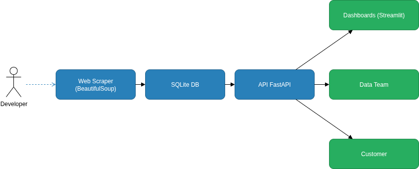

# 📚 BookOnTheTable

**BookOnTheTable** is a web application built with **FastAPI** that offers a **public RESTful API** for querying books, including features such as authentication, categorization, statistics, automated scraping, and endpoints designed for consumption by Machine Learning models.

> You can find all the challenge requirements and details in the official document:  
[Tech Challenge - Phase 1 - Machine Learning Engineering (PDF)](https://github.com/LucasTechAI/BookOnTheTable/blob/main/docs/Pos_tech%20-%20Tech%20Challenge%20-%20Fase%201%20-%20Machine%20Learning%20Engineering.pdf)

---

## 🌐 Public URL

Access the public API hosted on Vercel:

- 🔗 **API:** [https://book-on-the-table.vercel.app](https://book-on-the-table.vercel.app)  
- 📑 **Swagger UI:** [https://book-on-the-table.vercel.app/docs](https://book-on-the-table.vercel.app/docs)  
- 📘 **Redoc:** [https://book-on-the-table.vercel.app/redoc](https://book-on-the-table.vercel.app/redoc)  

---

## 🧩 Project Structure

```bash
BookOnTheTable/
├── data/
│   └── books_data.csv           # Extracted book data from scraping
├── docs/
│   ├── Pipeline.png             # System architecture diagram
│   └── Pos_tech - Tech Challenge - Fase 1 - Machine Learning Engineering.pdf
├── LICENSE                      # MIT License
├── main.py                      # Main API entry point
├── README.md                    # Project documentation
├── requirements.txt             # Main API dependencies
├── setup/                       # Helper scripts and configurations
│   ├── creator.sql             # Database creation script
│   ├── format_api.sh           # API code formatter
│   ├── format_scraper.sh       # Scraper code formatter
│   └── format_utils.sh         # Utils code formatter
├── src/
│   ├── api/                     # FastAPI application
│   │   ├── app.py              # FastAPI app configuration
│   │   ├── config.py           # API configuration settings
│   │   ├── middleware/         # Custom middleware
│   │   │   └── logging_middleware.py
│   │   ├── routes/             # API endpoints
│   │   │   ├── auth.py         # Authentication routes
│   │   │   ├── books.py        # Book-related endpoints
│   │   │   ├── categories.py   # Category endpoints
│   │   │   ├── health.py       # Health check endpoints
│   │   │   ├── home.py         # Home/root endpoints
│   │   │   ├── logs.py         # Logging endpoints
│   │   │   ├── ml.py           # Machine Learning endpoints
│   │   │   └── stats.py        # Statistics endpoints
│   │   ├── schemas/            # Pydantic models for validation
│   │   │   ├── auth_schema.py
│   │   │   ├── books_schema.py
│   │   │   ├── categories_schema.py
│   │   │   ├── health_schema.py
│   │   │   ├── logs_schema.py
│   │   │   ├── ml_schema.py
│   │   │   └── stats_schema.py
│   │   ├── services/           # Business logic layer
│   │   │   ├── auth_service.py
│   │   │   ├── book_service.py
│   │   │   ├── category_service.py
│   │   │   ├── health_service.py
│   │   │   ├── log_service.py
│   │   │   ├── ml_service.py
│   │   │   └── stats_service.py
│   │   └── utils/              # API utilities
│   │       ├── cache.py        # Caching utilities
│   │       └── jwt_handler.py  # JWT token handling
│   ├── dashboards/             # Streamlit monitoring dashboard
│   │   ├── app.py              # Dashboard main entry point
│   │   ├── api_client.py       # API communication client
│   │   ├── charts.py           # Interactive charts with Plotly
│   │   ├── components.py       # Reusable UI components
│   │   ├── config.py           # Dashboard configuration
│   │   ├── data_processing.py  # Data processing utilities
│   │   ├── pages.py            # Dashboard pages
│   │   ├── styles.py           # CSS styling
│   │   ├── requirements.txt    # Dashboard-specific dependencies
│   │   └── img/                # Dashboard assets
│   │       ├── logo.png        # Project logo
│   │       └── my.jpeg         # Profile image
│   ├── scraper/                # Web scraper using BeautifulSoup
│   │   ├── main.py             # Scraper entry point
│   │   └── scraping.py         # Scraping logic
│   └── test/                   # Automated tests
│       ├── all_routes.py       # Complete API testing
│       └── random_routes.py    # Random endpoint testing
├── tmp/
│   └── bookonthetable.db       # SQLite database file
├── utils/                      # General utilities
│   ├── database_manager.py     # Database operations
│   └── handler_api.py          # API request handlers
└── vercel.json                 # Vercel deployment configuration
```

---

## 🏗️ System Architecture

The following diagram shows the complete system architecture and data flow of the BookOnTheTable platform:



---


## 🚀 How to run the API locally

1. **Clone the repository**

```bash
git clone https://github.com/LucasTechAI/BookOnTheTable.git
cd BookOnTheTable
```

2. **Create and activate a virtual environment**

```bash
python3 -m venv venv
source venv/bin/activate      # Linux/macOS
venv\Scripts\activate       # Windows
```

3. **Install the dependencies**

```bash
pip install -r requirements.txt
```
4. **Run the application**

```bash
PYTHONPATH=. uvicorn src.api.app:app --reload
```

API Docs available locally at:  
📑 http://127.0.0.1:8000/docs

---

## ✅ Features

### 🔗 API Features
- JWT-based authentication (login, register, refresh)
- Book listing and search with advanced filtering
- Category management and filtering
- General and category-specific statistics
- ML-ready endpoints (features, training data, predictions)
- Automated scraping from books.toscrape.com
- Structured logging via middleware
- Continuous deployment on Vercel

### 📊 Dashboard Features
- Real-time API monitoring and log analysis
- Interactive data visualization with Plotly
- Performance metrics and response time tracking
- Endpoint usage analytics and patterns
- User activity and IP address monitoring
- Advanced filtering and search capabilities
- System health and uptime monitoring
- Secure authentication and access control

---

## 📡 Main Endpoints

### Books
- GET /api/v1/books
- GET /api/v1/books/{id}
- GET /api/v1/books/search?title=...&category=...
- GET /api/v1/books/top-rated
- GET /api/v1/books/price-range?min=10&max=50

### Categories
- GET /api/v1/categories

### Health & Logs
- GET /api/v1/health
- GET /api/v1/logs
- DELETE /api/v1/logs

### Authentication
- POST /api/v1/auth/register
- POST /api/v1/auth/login
- POST /api/v1/auth/refresh
- GET /api/v1/auth/protected

### Machine Learning
- GET /api/v1/ml/features
- GET /api/v1/ml/training-data
- POST /api/v1/ml/predictions
  
---

## 📊 Dashboard - Real-time API Monitoring

The project includes a comprehensive **Streamlit dashboard** for real-time API monitoring and log analysis.
### Features:
- 📈 Real-time API performance monitoring with Plotly
- 🎯 Endpoint usage analytics
- 👥 User activity tracking
- 🔍 Advanced filtering capabilities
- ⚡ System health monitoring

### Running the Dashboard Locally:

**Note:** The dashboard requires additional dependencies that exceed Vercel's size limits, so it runs separately.

1. **Navigate to the dashboard directory:**
```bash
cd src/dashboards
```

2. **Install dashboard-specific dependencies:**
```bash
pip install -r requirements.txt
```

3. **Run the Streamlit dashboard:**
```bash
streamlit run app.py
```

The dashboard will be available at: http://localhost:8501

### Why Separate Requirements?
- Streamlit and Plotly dependencies are heavy (~100MB+)
- Vercel has deployment size limitations for serverless functions
- The main API remains lightweight for optimal performance
- Dashboard can be deployed separately on Streamlit Cloud or other platforms

---

## 🕷️ Run Only the Scraper (Optional)

If you want to run the scraper separately to update or generate the `books_data.csv` file:

```bash
cd BookOnTheTable
python3 src/scraper/main.py
```

This will fetch all book data from [books.toscrape.com](https://books.toscrape.com/) and save it in `books_data.csv` for local use or further ML processing.

---

## 🛠️ Tech Stack

- Python 3.10+
- FastAPI
- SQLite3
- BeautifulSoup
- Pydantic
- Uvicorn
- Vercel (deployment)
- JWT

---

## 📜 License

This project is licensed under the MIT License. See the LICENSE file for more details.

---

## 👨‍💻 Author

**Lucas Mendes**  
Mid-Level Data Scientist  
🌐 https://musicmoodai.com.br  
📧 lucas.mendestech@gmail.com
🔗 https://www.linkedin.com/in/lucas-mendes-barbosa/